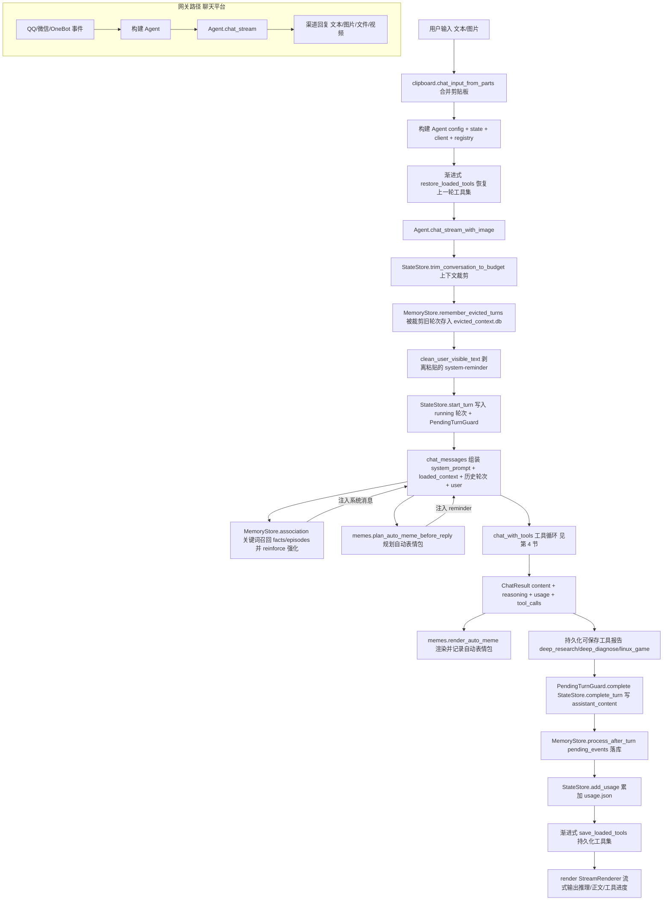
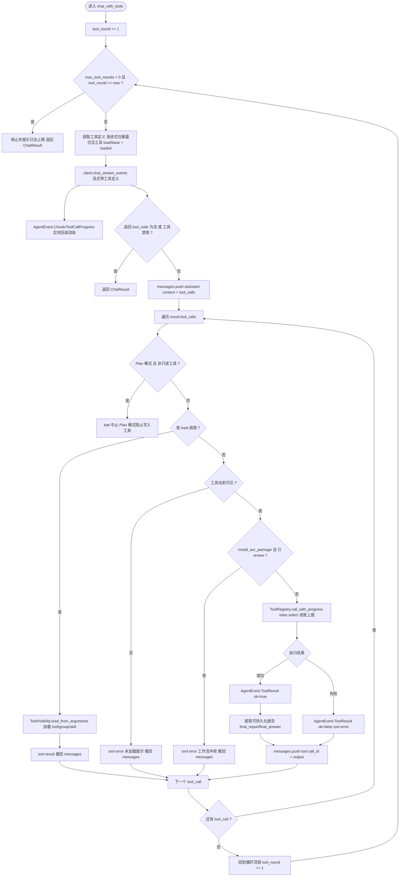
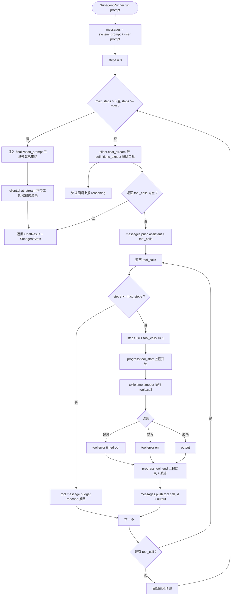
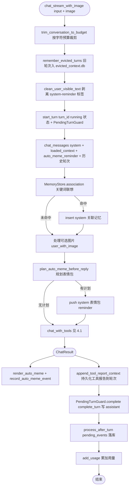

# Sai 架构说明

Sai 是 Rust 编写的终端 AI 桌面助手（二次元人格），由大模型驱动，集成 shell、多聊天平台网关、记忆系统、知识库与 30+ 内置工具。本文用 mermaid 描述架构、数据流、存储流与 Agent 循环。

## 1. 架构图（分层模块）

```mermaid
flowchart TB
    subgraph Entry["入口层"]
        MAIN["main.rs"]
        CLI["cli.rs / cli/"]
        REPL["REPL 交互循环"]
        ASK["ask 单轮对话"]
        SHELLINT["shell-intercept 拦截"]
        ALARMW["__alarm-worker 闹钟进程"]
        TOOLC["__tool 直接调用工具"]
    end

    subgraph Agent["Agent 层 agent/"]
        AGENT["Agent"]
        LOOP["chat_with_tools 循环"]
        VIS["ToolVisibility 渐进式加载"]
        MODE["AgentMode Yolo/Plan"]
        CONV["conversation 响应分类"]
    end

    subgraph LLM["LLM 层 llm/"]
        CLIENT["OpenAiCompatibleClient"]
        STREAM["stream_event 流式 SSE"]
        TCS["tool_call_stream 工具流解析"]
        THINK["thinking 推理协议"]
        PROTO["协议 openai-chat / openai-responses / anthropic"]
    end

    subgraph Tools["工具层 tools/"]
        REG["ToolRegistry 注册表"]
        BUILT["builtin_registry 30+ 内置工具"]
        RO["readonly_registry 只读集"]
        PROG["progressive 渐进分组"]
        SUB["subagent_runner 子代理循环"]
        TASK["task 后台子代理工具"]
        TODO["todo 会话级计划清单"]
        GRP["groups 工具分组"]
    end

    subgraph ToolsCat["内置工具分类"]
        T_FILE["文件/命令 run_command read write edit glob grep trash"]
        T_WEB["网络 web_search web_fetch search_web_images"]
        T_IMG["多模态 analyze_image print_image generate_image"]
        T_MEME["表情包 search/show/add_meme"]
        T_KB["知识库 upload/read/search_kb"]
        T_MEM["记忆 remember_fact recall_memory search_evicted"]
        T_DIV["玄学 tarot zhouyi fortune_lot dice"]
        T_SYS["系统 alarm weather exchange_rate man archlinux"]
        T_HEAVY["重型 deep_research deep_diagnose linux_game"]
    end

    subgraph State["状态层 state/"]
        SS["StateStore"]
        TURNS["turns/ SQLite conversation.db WAL"]
        PEND["pending_turn PendingTurnGuard"]
        LOADT["loaded_tools.json"]
        USAGE["usage.json"]
        MIG["jsonl 迁移"]
    end

    subgraph Memory["记忆层 memory/"]
        MS["MemoryStore"]
        FACTS["facts 知识点"]
        EPI["episodes 往事"]
        PE["pending_events 待处理事件"]
        EVI["evicted_turns 被裁剪上下文"]
        DECAY["decay 半衰期遗忘"]
        ASSOC["association 联想召回"]
    end

    subgraph Gateways["网关层 gateways/"]
        SUP["supervisor 并发启动"]
        MGR["manager 后台任务管理"]
        QQ["qq_bot WebSocket/Webhook"]
        WEIXIN["weixin_bot iLink 长轮询"]
        ONEBOT["onebot_server HTTP"]
        WECOM["wecom_webhook 企业微信"]
        CHAN["channel_context/tools 渠道工具"]
    end

    subgraph Config["配置层 config/ + config_tui/"]
        AC["AppConfig config.jsonc"]
        SEC["secrets.jsonc API keys"]
        PERSONA["persona 人格隔离"]
        TUI["config_tui TUI 配置器"]
    end

    subgraph Peripherals["外围"]
        SHELL["shell/ fish bash zsh pwsh hook"]
        PLATFORM["platform/ shell 抽象 PowerShell/cmd"]
        RENDER["render/ 流式渲染 Markdown LaTeX"]
        PATHS["paths/ XDG / 跨平台目录"]
        I18N["i18n 中英文"]
        PROMPTS["prompts/ 系统提示 build.rs 混淆嵌入"]
        CLIP["clipboard 剪贴板"]
        ALARM["alarm 闹钟管理"]
        MEMES["memes 表情包"]
        KBMAN["knowledge base 本地知识库"]
        WEB["web/ 工作台 终端 系统监控"]
    end

    MAIN --> CLI
    CLI --> REPL & ASK & SHELLINT & ALARMW & TOOLC
    REPL & ASK & SHELLINT --> AGENT
    TOOLC --> REG

    AGENT --> LOOP
    AGENT --> VIS
    AGENT --> MODE
    AGENT --> MS
    AGENT --> SS
    AGENT --> CLIENT
    LOOP --> REG
    LOOP --> VIS
    VIS --> PROG
    PROG --> GRP

    CLIENT --> STREAM
    CLIENT --> TCS
    CLIENT --> THINK
    CLIENT --> PROTO

    REG --> BUILT & RO
    BUILT --> T_FILE & T_WEB & T_IMG & T_MEME & T_KB & T_MEM & T_DIV & T_SYS & T_HEAVY
    REG --> TASK
    REG --> TODO
    TASK --> SUB
    SUB --> RO

    subgraph Cron["定时任务 cron/"]
        CRONDB["jobs.db 持久任务"]
        CRONS["Gateway scheduler 到期调度"]
        CRONRUN["Gateway 来源 Agent turn"]
    end
    CRONDB --> CRONS --> CRONRUN

    SS --> TURNS
    SS --> PEND
    SS --> LOADT
    SS --> USAGE
    SS --> MIG

    MS --> FACTS & EPI & PE & EVI
    MS --> DECAY
    MS --> ASSOC

    SUP --> QQ & WEIXIN & ONEBOT
    MGR --> QQ & WEIXIN
    QQ & WEIXIN & ONEBOT --> CHAN
    CHAN --> AGENT

    AC --> AGENT & SUP & MS & REG
    SEC --> CLIENT
    PERSONA --> MS & MEMES & PROMPTS

    SHELL --> SHELLINT
    PLATFORM --> REPL
    PLATFORM --> WEB
    AGENT --> RENDER
    CLI --> TUI
```

## 2. 数据流图（一轮对话的生命周期）

## 3. 存储流图（跨平台目录与数据库 schema）

```mermaid
flowchart LR
    subgraph Config["配置目录（Linux ~/.config/sai；Windows %APPDATA%\\sai）"]
        CFG["config.jsonc AppConfig"]
        SECRET["secrets.jsonc api_keys"]
        SKILLS["skills/ 已安装 skill 目录 SKILL.md"]
        PROMPTF["persona/system-prompt.md 人格提示"]
        IDENTITY["persona/identities/ 身份提示"]
        SHELLHOOK["shell hooks: bash/zsh/powershell + fish conf.d"]
    end

    subgraph State["运行状态（Linux ~/.local/state/sai；Windows 通常 %LOCALAPPDATA%\\sai）"]
        CONVDB["conversation.db SQLite WAL 对话轮次"]
        USAGEJ["usage.json 用量统计"]
        LOADJ["loaded-tools.json 渐进式工具集"]
        SHA["prompt.sha256 提示指纹 变更则重置会话"]
        PROFILE["profile.md 用户画像"]
        LOG["sai.log 日志"]
        ALARMD["alarms/ 闹钟状态与日志"]
        JSONL["conversation.jsonl 旧格式 迁移后弃用"]
    end

    subgraph Data["持久数据（Linux ~/.local/share/sai；Windows data 目录）"]
        KB["kb/ 知识库文件 + 关键词索引 + 语义嵌入"]
        PERSONA["persona/ 按人格隔离"]
        MEMEDIR["persona/memes/ 表情包图片 + 索引"]
        MEMDB["persona/memory/memory.db 记忆数据"]
        EVIDB["persona/memory/evicted_context.db 裁剪上下文"]
        AUTOSKILL["persona/skills/ 自动学习的 skill"]
    end

    subgraph Cache["缓存（Linux ~/.cache/sai；Windows cache 目录）"]
        CACHEF["临时缓存 文件/网络结果"]
    end

    subgraph Pics["图片产物（Linux ~/Pictures/sai；Windows Pictures\\sai）"]
        PICF["搜图/生图/截图保存"]
    end

    subgraph Schema1["conversation.db schema"]
        S_TURNS["turns turn_id PK seq user_content user_timestamp assistant_content assistant_reasoning assistant_timestamp status tool_reports"]
    end

    subgraph Schema2["memory.db schema"]
        S_FACTS["facts id content source status confidence strength recall_count last_recalled_at last_decay_at created_at updated_at"]
        S_EPI["episodes id content source status strength recall_count last_recalled_at last_decay_at created_at updated_at"]
        S_PE["pending_events id user_message assistant_message created_at processed_at"]
        S_SKR["skill_records id name path summary created_at updated_at"]
    end

    subgraph Schema3["evicted_context.db schema"]
        S_EVI["evicted_turns id timestamp role content created_at"]
    end

    CONVDB -.-> S_TURNS
    MEMDB -.-> S_FACTS & S_EPI & S_PE & S_SKR
    EVIDB -.-> S_EVI

    CFG -->|读写| AGENTW["Agent / Config"]
    SECRET -->|读| CLIENTW["LLM Client"]
    CONVDB -->|读写| STATEW["StateStore"]
    MEMDB -->|读写| MEMW["MemoryStore"]
    EVIDB -->|读写| MEMW
    USAGEJ -->|读写| STATEW
    LOADJ -->|读写| STATEW
    KB -->|读写| KBW["knowledge_base 工具"]
    MEMEDIR -->|读写| MEMESW["memes 工具"]
    PICF -->|写| IMGW["搜图/生图工具"]
```

## 4. Agent 循环图

### 4.1 主 Agent 循环 chat_with_tools

### 4.2 子代理循环 subagent_runner chat_with_tools

### 4.3 外层对话编排 chat_stream_with_image

---

## 关键说明

- **入口分发**：`main.rs` → `cli::run`，按子命令分发。无参数进 REPL，带消息走单轮对话，`--shell-intercept` 处理 shell command-not-found 拦截。
- **Agent 两种模式**：`Yolo` 自由调用工具；`Plan` 只允许只读工具，遇写入工具直接 bail。
- **渐进式工具加载**：启动仅暴露 `load` + 基础工具，模型按需调用 `load` 加载工具组/skill，可见集持久化到 `loaded-tools.json` 跨轮恢复。
- **记忆双库**：`memory.db` 存 facts/episodes/pending_events/skill_records；`evicted_context.db` 存被上下文裁剪掉的旧轮次。基于半衰期 strength 衰减实现遗忘，召回时 reinforce 强化。
- **子代理**：`task` 工具启动后台子代理，`SubagentRunner` 独立 LLM 循环，有 max_steps 预算与超时，预算耗尽注入 `finalization_prompt` 收尾。
- **网关**：`supervisor` 用 JoinSet 并发启动配置中启用的 QQ/微信/OneBot 渠道，事件接入后构建 Agent 走 `chat_stream`，再通过渠道工具回复。
- **存储隔离**：记忆、表情包、skills 按人格（persona）目录隔离；对话状态、用量、闹钟全局共享。
- **跨平台目录**：`paths::SaiPaths` 通过 `directories` 解析配置/数据/缓存/状态目录。Linux 遵循 XDG；Windows 映射到 `%APPDATA%` / `%LOCALAPPDATA%` 等标准位置。PowerShell hook 写入 `config_dir/shell/powershell-hook.ps1`。
- **平台 Shell 抽象**：`platform/shell` 统一命令执行、交互终端与外部编辑器启动。Windows 优先 `SHELL`，其次 `pwsh.exe` / `powershell.exe`，最后 `COMSPEC`/`cmd.exe`；按 Shell 类型生成 `-Command`、`/C` 或 POSIX `-lc` 参数。REPL `!` 命令、Web 终端与默认编辑器均走此抽象。
- **Windows 能力边界**：已支持 PowerShell 命令未找到拦截、CLI、Web 工作台/终端、剪贴板、音频闹钟、进程 CPU/RSS 监控与命令执行。审计 Shell 沙盒依赖 Linux `bubblewrap`，Windows 上不启用；`check_issue` 目前仅 Linux/macOS。文件搜索需本机 `rg`，工作区 Git 功能需 `git`。
- **CI**：`.github/workflows/windows.yml` 在 `windows-latest` 上构建 Web 资源并运行 `cargo test --locked` 与前端测试。
