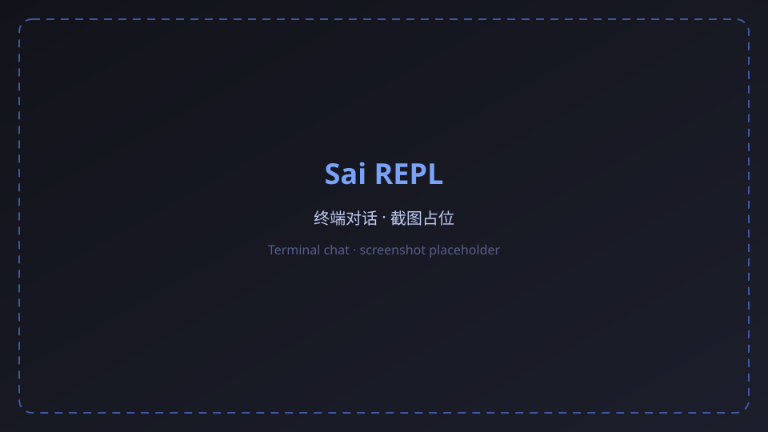
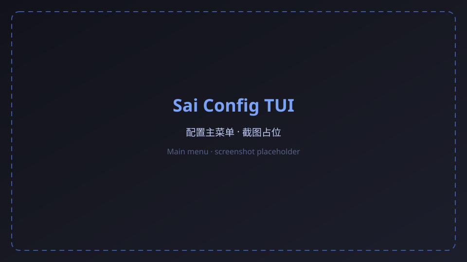
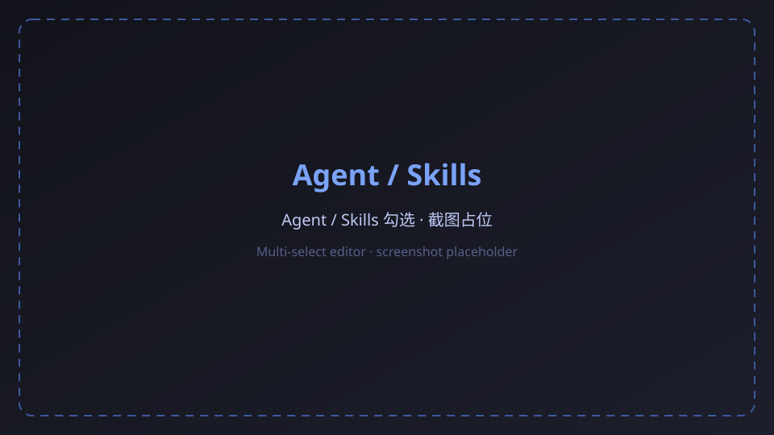
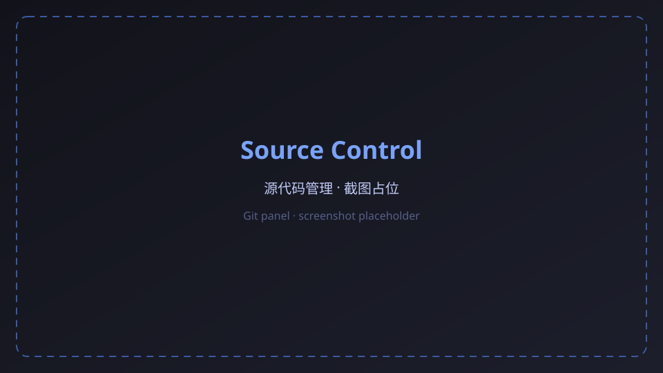

# Sai

**A terminal-native AI desktop assistant with a persona**
Multi-protocol LLM · 30+ built-in tools · Long-term memory · Chat platform gateways · Web workbench · Cross-platform

[English](README.md) | [简体中文](README.zh-CN.md)

[](LICENSE)
[](https://www.rust-lang.org/)
[](https://github.com/jswysnemc/sai)
[](https://github.com/jswysnemc/sai/actions/workflows/linux.yml)
[](https://github.com/jswysnemc/sai/actions/workflows/windows.yml)
[](https://github.com/jswysnemc/sai/actions/workflows/macos.yml)

[Why Sai](#why-sai) · [Screenshots](#screenshots) · [Core capabilities](#core-capabilities) · [Installation](#installation) · [Quick start](#quick-start) · [CLI reference](#cli-reference) · [Architecture](#architecture) · [Storage layout](#storage-layout) · [FAQ](#faq) · [Acknowledgments](#acknowledgments) · [Friend links](#friend-links) · [Contributing](#contributing)

---

## Why Sai?

Sai is a terminal-native AI desktop assistant written in Rust. It fuses large language model reasoning with local system tools, long-term memory, chat platform gateways, and a web workbench. Use it as a one-shot CLI Q&A tool, an interactive REPL, a long-running service bridging QQ / WeChat / WeCom, or drive it from a browser.

This project is a fork of [Miyu](https://github.com/SHORiN-KiWATA/Miyu). It continues the upstream architecture and capabilities while staying cross-platform. Some tools come directly from upstream and are Linux-only today (for example Arch package management, parts of system diagnostics, and game-compatibility helpers). On Windows and macOS, disable those tools in the Agent / tool configuration so the model does not call them.

- **An assistant that acts** - Beyond conversation: read/write files, run commands, dispatch subagents, run deep research and system diagnostics
- **Triple-protocol adaptive** - OpenAI Chat / OpenAI Responses / Anthropic Messages auto-detected; any compatible provider works out of the box
- **Personality with memory** - Cross-session long-term memory (facts / episodes), half-life forgetting and associative recall, isolated per persona
- **Multiple entry points** - Terminal REPL, one-shot ask, web workbench, QQ / WeChat / WeCom gateways, all sharing one Agent core

---

## Screenshots

Streaming REPL chat, built-in tool replies, the config TUI, plus the web workbench for subagents and Source Control.

> UI shots below are placeholders; real screenshots will replace them later.

### Terminal REPL



### Config TUI

Run `sai config` (also reachable from the REPL) for the terminal configurator. The main menu is layered by frequency: active configuration, providers and models, Agent, tools, Skills, advanced settings.





### Built-in tools


### Web workbench





---

## Core capabilities

### Multi-protocol LLM access

- **Triple-protocol adaptive** - OpenAI Chat, OpenAI Responses, Anthropic Messages; `auto` mode picks by provider, or set explicitly
- **Any compatible provider** - Built-in templates for opencode Zen, OpenAI, Anthropic; custom `base_url` for any third-party compatible service; multiple API keys per provider with load balancing
- **Thinking chain control** - `thinking_level` seven tiers (auto / none / low / medium / high / xhigh / max); `thinking_format` covers string / object / deepseek-thinking / openai-chat-reasoning-effort / reasoning / anthropic-thinking
- **Streaming rendering** - Real-time Markdown streaming with KaTeX math, Mermaid diagrams, Syntect syntax highlighting, o200k tokenizer counting
- **Context compaction** - Long conversations are summarized by a dedicated compaction model, preserving key information without losing context

### Agent and progressive tool system

- **Three permission modes** - `Yolo` free tool use, `Audited` (sandbox + audit log + per-call confirm), `Plan` read-only
- **Progressive tool loading** - Only `load` and base tools are exposed at start; the model calls `load` to pull in tool groups or skills on demand; the visible set persists to `loaded-tools.json` across turns
- **30+ built-in tools** - Grouped by purpose: `base` file/command, `web` lookup, `media` image/meme, `research` deep research, `memory` recall, `package` Arch Linux, `game` compatibility, `diagnostics` system, `knowledge` base, `utilities` calc/encode, `personal` alarm, `ssh` remote hosts, `mcp` external
- **Subagents** - The `subagent` tool starts an independent LLM loop with a `max_steps` budget and timeout; writable tasks auto-create a `.sai-subagents` git worktree for isolation, then apply back and clean up on success. Persistent agents can idle and take follow-ups (REPL `/subagents`, `/msg`)
- **Skills** - Reusable `SKILL.md` skill packs with three visibility tiers (hidden / name-only / full); enable / disable / list / stats / prune from the TUI or CLI
- **MCP bridging** - Native stdio / http MCP servers; tools registered with `mcp_` prefix; dedicated `mcp.jsonc` config
- **Session-level Todo** - A plan checklist tracked across tool rounds
- **Cron jobs** - bash / http / prompt types, persisted to `jobs.db`, triggered by a background scheduler

### Long-term memory and context

- **Dual-store** - `memory.db` holds facts / episodes / pending_events / skill_records; `evicted_context.db` holds turns trimmed from the context window
- **FTS5 full-text index** - unicode61 + trigram tokenizer for mixed Chinese/English retrieval
- **Markdown source files** - Memory is also persisted as `memory/files/{facts,episodes}/*.md`, human-readable and editable
- **Half-life forgetting** - A strength-based decay algorithm yields natural forgetting; recall reinforces frequently used memories
- **Associative recall** - Before each turn, keywords recall relevant facts / episodes and inject them as system messages
- **Per-persona isolation** - Memory, memes, and skills are isolated under the `persona` directory; personas never cross-contaminate

### Chat platform gateways

- **QQ Bot** - WebSocket and Webhook transports; official QQ channels / groups / DMs
- **QQ Official** - Tencent official QQ OpenAPI client
- **WeChat iLink** - Long-polling bridge with QR login; image / file / video messages
- **OneBot HTTP Server** - Standard OneBot v11 server, interoperable with any OneBot implementation
- **WeCom Webhook** - Group robot push
- **Concurrent supervision** - `supervisor` starts all enabled channels concurrently via JoinSet; `manager` governs background task lifecycles
- **Channel tools** - Gateway-side `send_channel_image` / `send_channel_file` / `send_channel_video` let the Agent proactively push media back to chat platforms

### Permission, audit, and sandbox

- **Three tiers** - Yolo / Audited / Plan; TUI and CLI can set independent defaults
- **Workspace sandbox** - In Audited mode, Linux uses `bubblewrap` to confine writes to the workspace; Windows and macOS keep audit checks but do not provide command isolation
- **Sensitive path protection** - Reads of sensitive paths (SSH keys, credential dirs, etc.) always require explicit permission
- **Audit log** - Every Requested / Approved / Denied event is appended to `permission-audit.jsonl` for traceability
- **Permission broker** - A unified request/decision channel shared by TUI / CLI / Web, with optional denial replies

### Web workbench

Run `sai web` and a browser opens a full remote programming workbench:

- **Multi-session** - List, create, rename, delete, resume sessions
- **Live chat** - Streaming render on par with the REPL, with image paste
- **Monaco editor** - In-browser code editing wired to local files
- **xterm terminal** - Full terminal in the browser via the platform shell abstraction
- **Subagent panel** - Inspect subagent status and timelines
- **Background tasks** - Manage long-running processes and cron jobs
- **System monitor** - Real-time CPU / RSS charts
- **Settings center** - Graphical config for providers, models, permissions, gateways, MCP, hooks, memory, personas, skills
- **i18n** - Chinese / English UI toggle
- **Access control** - `--host` bind address (localhost by default); `sai web-password` sets an access password
- **Conversation branches** - Fork, browse, and switch from any turn; the branch-overview canvas supports pan and zoom
- **External engines** - Connect Claude / Codex ACP kernels from the composer; they share the same session and timeline
- **Markdown styles** - Switchable render presets; reasoning and tool calls collapse into step groups

#### Source Control

The Web workbench includes a Source Control panel backed by the system `git`. It supports staging/discarding changes, branch and remote operations, commit-graph browsing, and text conflict merging, with UX similar to VS Code.

### Cross-platform shell integration

- **Shell interception** - Unknown commands are forwarded to the Agent for natural-language explanation or fix suggestions
- **Hook install** - `sai fish-init` / `bash-init` / `zsh-init` / `powershell-init` installs the command-not-found hook for the target shell
- **Platform abstraction** - Windows prefers `SHELL`, then `pwsh.exe` / `powershell.exe` / `cmd.exe`; POSIX uses `-lc`
- **System directories** - Linux follows XDG; Windows and macOS use their standard application directories

### Internationalization

- **Bilingual** - `en-US` and `zh-CN` UI languages, auto-detected from `SAI_LANG` / `LC_ALL` / `LANG`, overridable with `--lang`
- **Full-chain localization** - CLI prompts, TUI, web workbench, and error messages all support both languages

### Config TUI

Run `sai config` for the terminal configurator. The 7-item main menu is layered by frequency; number keys jump directly:

1. **Active configuration** - Pick the default provider and model for new chats
2. **Providers and models** - Browse, add, delete, or refresh the catalog
3. **Agent configuration** - Sectioned editor for basics, system prompt, tool capabilities, and Skills; tools / Skills use a multi-select list (hidden / enabled / deferred) instead of typing names
4. **Tools** - Toggle assistant tools; web search lives in the same list
5. **Skills** - List installed skills, Space to enable/disable; global switches live on the same page
6. **Advanced settings** - Knowledge base, gateway channels, and global parameters (permissions / terminal & context / tools & background commands / display)
7. **Save and exit** - Persist in-memory changes to disk

### Conversation branches

Turns are stored as a tree and can fork from any message. Both the TUI and the web workbench can browse and switch branches; the web UI also has a pan-and-zoom branch overview.

---

## Installation

### System requirements

| Platform | Requirements |
| --- | --- |
| Linux | x86_64; `ripgrep` (file search), `alsa-lib` (audio alarms); audit sandbox requires `bubblewrap` |
| Windows | x86_64; WebView2 or a modern browser for the web workbench; `ripgrep` |
| macOS | Apple Silicon or Intel; a modern browser for the web workbench; `ripgrep` recommended |

### Build from source

Requires Rust stable, Node.js 22, npm.

```bash
# 1. Clone
git clone https://github.com/jswysnemc/sai.git
cd Sai

# 2. Build web assets (web workbench)
cd web
npm ci
npm run build
cd ..

# 3. Build the Sai binary
cargo build --release --locked

# 4. Verify
./target/release/sai --version
```

Linux also needs system dependencies:

```bash
sudo apt-get install --yes \
  libasound2-dev \
  libwayland-dev \
  libxkbcommon-dev \
  pkg-config \
  ripgrep
```

### Arch Linux

The repo ships `scripts/package-arch.sh` to build a `.pkg.tar.zst` installable with `pacman -U`:

```bash
cargo build --release --locked
bash scripts/package-arch.sh
sudo pacman -U ~/.cache/sai/packages/sai-<version>-1-x86_64.pkg.tar.zst
```

### Prebuilt binaries

Every push to `main` builds Linux, Windows, and macOS binaries. Download artifacts from [Actions](https://github.com/jswysnemc/sai/actions).

Pushing a `v*` tag runs the **Release** workflow and publishes assets on [Releases](https://github.com/jswysnemc/sai/releases):

- `sai-linux-x86_64`
- `sai-windows-x86_64.exe`
- `sai-macos-arm64`
- matching `.sha256` checksums

```bash
git tag v0.2.0
git push origin v0.2.0
```

You can also run the **Release** workflow manually from Actions and supply an existing tag.

### Docker image

Images are published to GitHub Container Registry:

```bash
# latest main
docker pull ghcr.io/jswysnemc/sai:latest

# version tag
docker pull ghcr.io/jswysnemc/sai:0.2.0
```

Build locally:

```bash
docker build -t sai:local .
docker run --rm -it \
  -v "$HOME/.config/sai:/config/sai" \
  -v "$PWD:/workspace" \
  -p 4096:4096 \
  sai:local web --port 4096 --no-open
```

On `main` / `v*` tags, the **Docker** workflow builds and pushes `ghcr.io/<owner>/sai` (PRs build only). Log in with `docker login ghcr.io` if the package is private.

---

## Quick start

### 1. Initialize

The first run auto-launches the init wizard to generate the config directory and default files:

```bash
sai init
```

Or just start the REPL; missing config triggers init automatically:

```bash
sai
```

### 2. Configure a provider

Edit the config file (Linux `~/.config/sai/config.jsonc`, macOS `~/Library/Application Support/sai/config.jsonc`, Windows `%APPDATA%\sai\config.jsonc`):

```jsonc
{
  "active_provider": "opencode",
  "providers": [
    {
      "id": "opencode",
      "display_name": "opencode Zen",
      "base_url": "https://opencode.ai/zen/v1",
      "protocol": "auto",
      "default_model": "big-pickle"
    }
  ]
}
```

API keys go in `secrets.jsonc` (same dir), supporting `$env:VAR_NAME` references:

```jsonc
{
  "api_keys": {
    "opencode": "$env:OPENCODE_API_KEY",
    "anthropic": "$env:ANTHROPIC_API_KEY"
  }
}
```

You can also run `sai config` for the built-in TUI configurator, or use the settings center in `sai web`.

### 3. Interactive REPL

```bash
sai
```

The REPL supports multi-line input, image paste (`-c` reads from clipboard), `!` prefix for shell, `/` prefix for control commands, fuzzy history search, and streaming render of reasoning and body text.

### 4. One-shot chat

```bash
sai ask "write a quicksort in rust"
sai ask -c "what is in this image"     # attach clipboard image
sai ask -w "latest rust stable features"  # trigger web search
```

### 5. Launch the web workbench

```bash
sai web --port 4096
sai web --host 0.0.0.0 --port 4096   # set `sai web-password set` before exposing the bind
```

A browser opens automatically to `http://localhost:4096`.

### 6. Shell interception

After installing a hook, unknown commands in the terminal are forwarded to Sai:

```bash
sai fish-init      # or bash-init / zsh-init / powershell-init
exec $SHELL        # reload the shell

# Now type a nonexistent command
$ nonexist-cmd --flag
# Sai takes over and explains or suggests a fix
```

### 7. Connect a chat platform

Edit the `gateways` section of `config.jsonc`, or use `sai gateway` subcommands to bring up individual channels. Once configured, `sai gateway start` launches all enabled channels at once.

---

## CLI reference

| Command | Description |
| --- | --- |
| `sai` | Enter the interactive REPL |
| `sai ask <message>` | One-shot chat; supports `-c` image, `-w` web search |
| `sai web [--port N] [--host ADDR] [--no-open]` | Launch the web workbench |
| `sai web-password set/clear/status` | Web access password |
| `sai init` | Initialize the config directory |
| `sai paths` | Print all directory locations |
| `sai config` | Open the config TUI |
| `sai config validate` | Validate the config file |
| `sai config paths` | Print config paths |
| `sai models` | Interactive model and thinking-level picker |
| `sai providers [index]` | View or switch the active provider |
| `sai set thinking [level]` | Set the thinking-chain level |
| `sai fish-init` / `bash-init` / `zsh-init` / `powershell-init` | Install the command-not-found hook |
| `sai remove-shell-hook` | Remove installed shell hooks |
| `sai history [--limit N] [--raw]` | View conversation history |
| `sai sessions list` / `new` / `switch` / `resume` / `current` / `delete` / `rename` | Session management |
| `sai resume [id]` | Resume a session; interactive pick when ID omitted |
| `sai kb add/list/search/find/read/remove/reindex/stats/embed` | Local knowledge base |
| `sai memory stats/reset/search/remember` | Memory management |
| `sai skills list/show/enable/disable/remove/stats/prune` | Skills management |
| `sai ps` | Background command management |
| `sai gateway start` | Start all enabled channels from config |
| `sai gateway qq-bot` / `qq-bot-webhook` / `qq-official` | QQ channels |
| `sai gateway onebot-server` / `weixin-server` / `wecom-webhook` | Other channels |
| `sai weixin-login` | WeChat QR login |
| `sai clear [--memory] [scope]` | Clear conversation or memory |
| `sai compact` | Manually trigger context compaction |

Global flags: `--lang en-US|zh-CN` (language), `--plan` / `--audited` / `--yolo` (permission mode), `--thinking LEVEL` (thinking chain), `-c` (clipboard), `-w` (web search).

---

## Architecture

Sai is layered around a shared Runner and Agent core. Entrypoints feed normalized submissions into the Runner; the Agent coordinates LLM calls, tools, memory, and session state.


### Tech stack

| Component | Technology |
| --- | --- |
| Core | Rust 2021 edition · Tokio async runtime |
| LLM client | reqwest + rustls · SSE streaming · triple-protocol adaptive |
| Storage | rusqlite (bundled) · SQLite WAL · FTS5 full-text index |
| Terminal | crossterm · termimad · ratex (LaTeX) · syntect highlight · mermaid-rs-renderer |
| Web server | axum + WebSocket + embedded static assets |
| Web frontend | React 19 · Vite 8 · TypeScript · Monaco · xterm · KaTeX · Mermaid · TanStack Query |
| Build | build.rs (prompt obfuscation + o200k tokenizer compiled in) · rust-embed |
| CI | GitHub Actions (Linux + Windows + macOS) |

### Project structure

```
Sai/
├── src/
│   ├── agent/            # Agent core: loop, mode, compaction, subagent, context projection
│   ├── cli/              # CLI subcommand dispatch and REPL implementation
│   ├── llm/              # LLM client: triple-protocol, streaming, thinking, tool-call stream
│   ├── tools/            # 30+ built-in tools, registry, progressive loading, subagent, skills
│   ├── memory/           # Long-term memory: facts/episodes/FTS5/decay/association
│   ├── state/            # Session state: turns WAL, pending, compaction, snapshot, recovery
│   ├── gateways/         # Multi-platform gateways: QQ/WeChat/OneBot/WeCom, supervisor
│   ├── config/           # Config: AppConfig, providers, permissions, gateways, MCP, models
│   ├── config_tui/       # Terminal config UI: main menu, Agent/tools/Skills, advanced settings
│   ├── permission/       # Permissions: broker, policy, sandbox, audit log
│   ├── mcp/              # MCP bridging: stdio/http client and registration
│   ├── shell/            # Shell hooks: fish/bash/zsh/powershell
│   ├── platform/         # Cross-platform shell abstraction
│   ├── web/              # Web workbench server
│   ├── render/           # Terminal streaming render
│   ├── prompts/          # System prompt templates (obfuscated by build.rs)
│   ├── i18n/             # Chinese / English i18n
│   ├── cron/             # Cron job scheduling
│   └── ...               # alarm/memes/knowledge_base/hooks, etc.
├── web/                  # Web workbench frontend (React + Vite)
├── assets/               # o200k tokenizer vocabulary
├── pics/                 # Screenshots and architecture overview
├── Dockerfile            # container image
├── scripts/              # Packaging scripts (package-arch.sh)
├── .github/workflows/    # CI (linux.yml + windows.yml + macos.yml)
├── build.rs              # Build script
└── Cargo.toml            # Rust package manifest
```

---

## Storage layout

Sai follows XDG on Linux, the Application Support and Caches conventions on macOS, and Known Folders on Windows. Run `sai paths` to inspect all paths.

### Config directory

Linux `~/.config/sai` / macOS `~/Library/Application Support/sai` / Windows `%APPDATA%\sai`

| File / Dir | Purpose |
| --- | --- |
| `config.jsonc` | Main config: providers, permissions, gateways, plugins, personas |
| `secrets.jsonc` | API key secrets; supports `$env:VAR` references |
| `mcp.jsonc` | Dedicated MCP server config |
| `skills/` | Installed skills directory |
| `persona/` | Persona dir: `system-prompt.md`, `identities/` |
| `shell/` | Shell hook scripts (fish / bash / zsh / powershell) |

### State directory

Linux `~/.local/state/sai` / macOS `~/Library/Application Support/sai` / Windows `%LOCALAPPDATA%\sai`

| File / Dir | Purpose |
| --- | --- |
| `conversation.db` | SQLite WAL conversation turn store |
| `usage.json` | Token usage stats |
| `loaded-tools.json` | Progressive tool visibility set (cross-turn restore) |
| `prompt.sha256` | System prompt fingerprint; change resets the session |
| `profile.md` | User profile |
| `sai.log` | Runtime log |
| `alarms/` | Alarm state and logs |
| `permission-audit.jsonl` | Permission audit log |

### Data directory

Linux `~/.local/share/sai` / macOS `~/Library/Application Support/sai` / Windows `%APPDATA%\sai`

| File / Dir | Purpose |
| --- | --- |
| `kb/` | Local knowledge base: files + keyword index + semantic embeddings |
| `persona/<name>/memes/` | Meme images and index (per-persona isolation) |
| `persona/<name>/memory/memory.db` | Memory metadata + FTS5 index |
| `persona/<name>/memory/files/` | Markdown memory sources (facts / episodes) |
| `persona/<name>/memory/evicted_context.db` | Trimmed old context |
| `persona/<name>/skills/` | Auto-learned skills |

### Other dirs

- Cache: Linux `~/.cache/sai` / macOS `~/Library/Caches/sai` / Windows `%LOCALAPPDATA%\sai`
- Image artifacts: Linux `~/Pictures/sai` / macOS `~/Pictures/sai` / Windows `Pictures\sai`

---

## FAQ

**Do API keys ever leave my machine?**

No. Keys stay in the local `secrets.jsonc`; requests go directly from the local LLM client to the provider. In gateway mode the local Agent still issues requests; chat platforms only relay messages.

**Is the gateway required?**

No. The terminal REPL, one-shot ask, and web workbench all work locally. Configure gateways only when you want QQ / WeChat / WeCom to reach the Agent.

**Which models are supported?**

Any model compatible with OpenAI Chat, OpenAI Responses, or Anthropic Messages. opencode Zen, OpenAI, and Anthropic templates are bundled; custom `base_url` accepts any third-party relay.

**Does long-context get lost?**

No. Turns beyond the character budget are written to `evicted_context.db` and can be recalled by memory tools. A dedicated compaction model can also summarize history while preserving key points.

**Does the sandbox work on Windows or macOS?**

No. The audit sandbox relies on Linux `bubblewrap`. On Windows and macOS, Audited mode still provides audit logging, workspace path validation, and per-call confirmation, but command isolation is disabled.

**Do subagents pollute the main workspace?**

No. Writable subagent tasks auto-create a `.sai-subagents` git worktree for isolation, then apply back and clean up only on success.

**Are some tools unavailable on Windows / macOS?**

Yes. Several tools inherited from upstream [Miyu](https://github.com/SHORiN-KiWATA/Miyu) are Linux-only. On other platforms, manually disable those tools in the Agent configuration so the model does not attempt to use them.

---

## Acknowledgments

Sai is a fork of [Miyu](https://github.com/SHORiN-KiWATA/Miyu). Thanks to upstream author [SHORiN-KiWATA](https://github.com/SHORiN-KiWATA) for open-sourcing the architecture, Agent core, and many foundational capabilities that this repository continues to maintain and extend. Some tool implementations still follow upstream; their Linux-only adaptation is noted above.

---

## Friend links

- [LINUX DO](https://linux.do/) - A next-generation Linux community

---

## Contributing

Issues and pull requests are welcome. Before submitting, ensure:

1. Rust tests pass: `cargo test --locked`
2. Web frontend builds and tests pass: `cd web && npm ci && npm run build && npm test`
3. Config validates: `sai config validate`
4. Commit messages follow Conventional Commits (`feat:` / `fix:` / `docs:`)

## License

[MIT](LICENSE) © SHORiN-KiWATA
