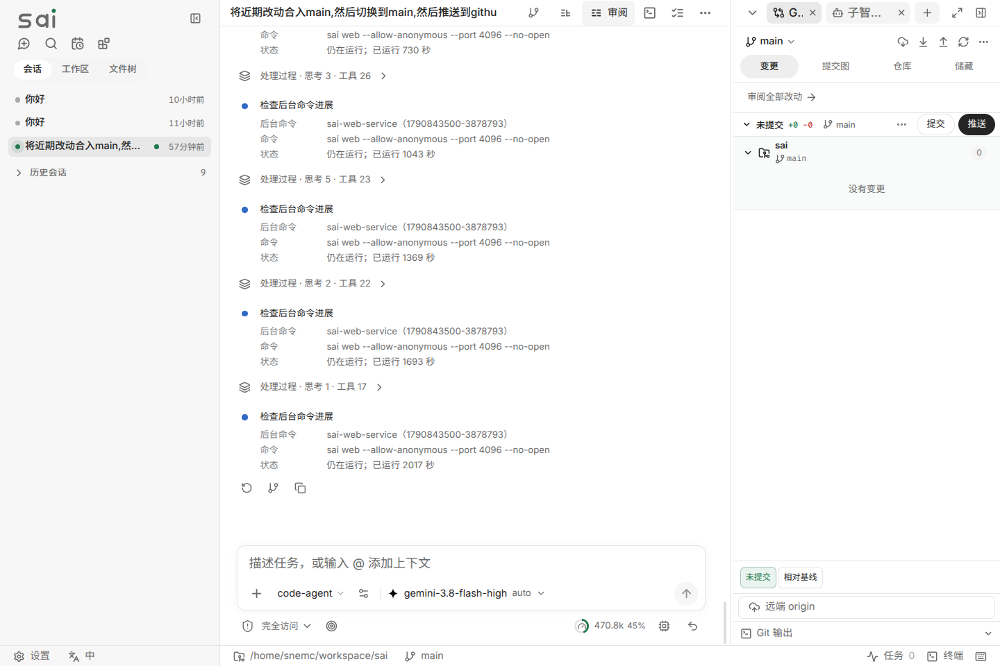
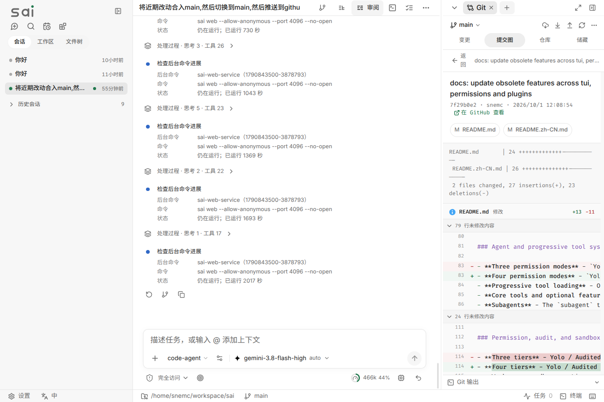
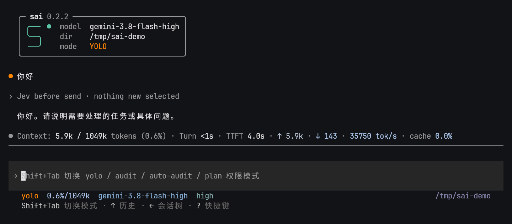
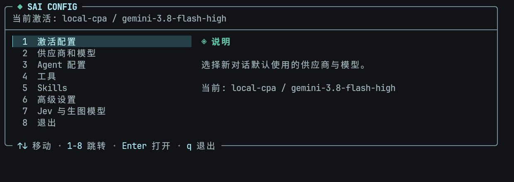
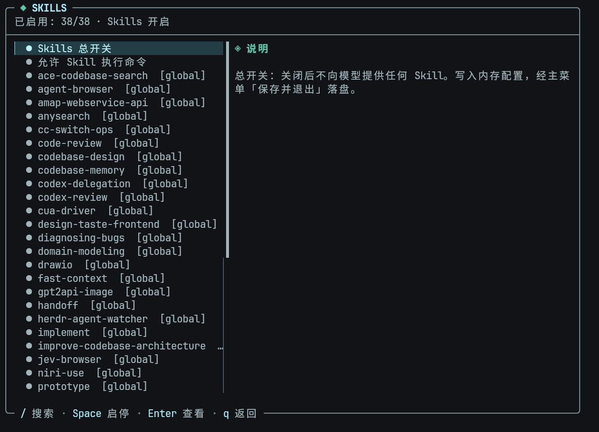
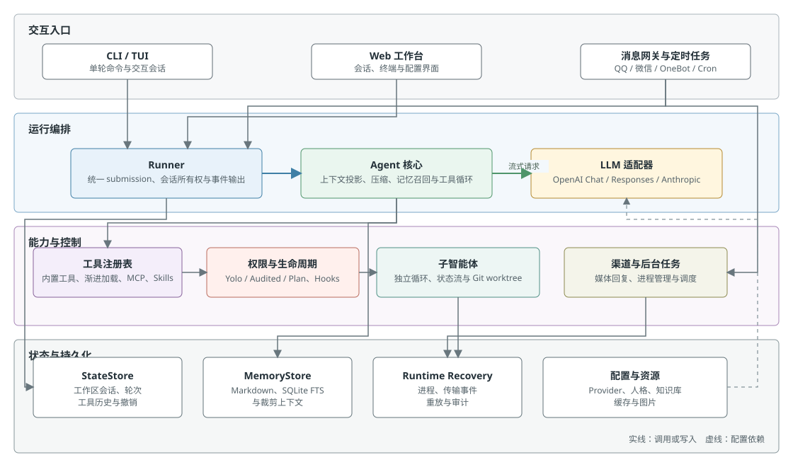

# Sai

**High-performance terminal-native and desktop AI programming workbench**
Multi-protocol LLM · System-level sandbox & Plan mode · Progressive tool loading · Web workbench · Long-term memory · Cross-platform

[English](README.md) | [简体中文](README.zh-CN.md)

[](LICENSE)
[](https://www.rust-lang.org/)
[](https://github.com/jswysnemc/sai)
[](https://github.com/jswysnemc/sai/actions/workflows/linux.yml)
[](https://github.com/jswysnemc/sai/actions/workflows/windows.yml)
[](https://github.com/jswysnemc/sai/actions/workflows/macos.yml)

[Why Sai](#why-sai) · [Screenshots](#screenshots) · [Core capabilities](#core-capabilities) · [Installation](#installation) · [Quick start](#quick-start) · [CLI reference](#cli-reference) · [Architecture](#architecture) · [Storage layout](#storage-layout) · [FAQ](#faq) · [Acknowledgments & License](#acknowledgments--license)

---

## Why Sai

Sai is a high-performance AI programming assistant and desktop workbench written in Rust. It bridges large language model reasoning with local system tools, OS-level isolation sandboxing, long-term memory, a modern web workbench, and communication platform gateways. It serves as an interactive terminal REPL, a one-shot CLI assistant, and a full-featured local or remote programming environment.

Originated from [Miyu](https://github.com/SHORiN-KiWATA/Miyu), Sai retains the foundational design while undergoing major architectural refactoring and feature additions. It focuses on robust cross-platform capability, fine-grained permission sandboxing, an independent Plan workflow, an integrated web workbench, progressive context management, and Jev capability routing.

- **System-integrated toolchain**: File manipulation, granular patch editing, background command process supervision, codebase search, native read-only web search/fetch, and browser automation.
- **Triple-protocol adaptive engine**: Native compatibility with OpenAI Chat, OpenAI Responses, and Anthropic Messages protocols, supporting both official endpoints and compatible third-party gateways.
- **Strict sandbox & audit**: OS-level write containment (Linux bubblewrap / macOS Seatbelt), sensitive credential interception, and an independent read-only Plan mode.
- **Modern dual interface**: Fullscreen transcript browsing with block folding in the terminal TUI, alongside a Web workbench featuring Monaco editor, xterm terminal, built-in browser, and a Git review panel.
- **Progressive context & Jev routing**: On-demand tool loading and Jev preselection maximize prompt cache hits and sustain long-running sessions.

---

## Screenshots

### Web programming workbench

Timeline session view, plan execution stream, Monaco editor, built-in browser viewport, Git review panel, and prompt template suggestions.





### Terminal interactive REPL

Fullscreen transcript view, code and reasoning folding, streaming math and charts, with OSC 52 drag-to-copy.



### Terminal config TUI

Run `sai config` to open the hierarchical configurator covering providers, models, agent profiles, tools, and sandboxing policies.





---

## Core capabilities

### Multi-protocol LLM engine & reasoning control

- **Triple-protocol adaptive access**: Automatic detection or manual override for OpenAI Chat, OpenAI Responses, and Anthropic Messages protocols. Includes built-in presets for opencode Zen, OpenAI, and Anthropic, alongside custom endpoints and multi-key load balancing.
- **Granular reasoning effort**: 7 reasoning tiers (`auto`, `none`, `low`, `medium`, `high`, `xhigh`, `max`), compatible with DeepSeek reasoning, OpenAI reasoning effort, and Anthropic thinking protocols.
- **Streaming rich-text rendering**: Real-time token streaming with native KaTeX formulas, Mermaid diagrams, Syntect syntax highlighting, and accurate token metering.
- **Context auto-compaction**: When exceeding token budgets, a dedicated model condenses historical context. Truncated turns are archived in `evicted_context.db` for associative memory retrieval.

### Permissions, system sandbox & Plan mode

- **Three permission tiers**:
  - `Yolo`: Full automatic tool execution without approval prompts.
  - `Audited`: Restricted to workspace sandbox, blocks sensitive paths, prompts on each call, and logs to `permission-audit.jsonl`.
  - `Auto-audit`: LLM / Jev heuristic inspection parallel to user confirmation.
- **OS-level workspace sandbox**:
  - Linux uses `bubblewrap` to enforce write boundaries strictly within the workspace;
  - macOS leverages native `Seatbelt` (`sandbox-exec`) for process containment;
  - Windows enforces path white-listing and blocks sensitive credential paths;
  - Run `/sandbox` anytime to inspect the current backend status and writable roots.
- **Independent read-only Plan mode**:
  - Enter via `/plan` or model invocation of `enter_plan_mode`, decoupled from execution permission tiers;
  - Operates inside a read-only sandbox for codebase discovery, dependency inspection, and web fetching; uses `ask_question` to clarify ambiguities;
  - Composes Markdown plans specifying objectives, file scopes, step-by-step tasks, and verification methods; submitted via `exit_plan_mode`;
  - Previews plan cards in TUI and Web; clicking `Approve and implement` restores the prior permission tier and executes the plan seamlessly.

### Progressive tool system & Jev routing

- **Progressive tool loading**: Exposes a minimal initial toolset. The model invokes `load` to pull in specific tool groups or skills as needed, persisting to `loaded-tools.json`, reducing context clutter and hallucination.
- **Jev dynamic capability router**: Pre-selects required capabilities during user submission, exposing tool schemas and skill documents dynamically to maintain prompt cache prefix stability.
- **Native toolchain**:
  - File precision editing: Exact line replacements (`str_replace`), read exploration (`read_file`), full write (`write_file`), safe trash recycling (`trash_path`);
  - Process execution & background management: Foreground execution and background command supervisor (`run_command` / `background_command`), with auto-demotion and status updates;
  - Native web tools: Read-only `web_search` (with TinyFish, Tavily, Firecrawl, AnySearch, SearXNG, DuckDuckGo failover) and `web_fetch` (direct page text/markdown extraction without Python dependencies);
  - Structured queries (`ask_question`): Card-based single/multi-choice selection with custom inputs.
- **Subagents**:
  - Independent LLM loops governed by `max_steps` budgets;
  - Writable tasks automatically run inside an isolated `.sai-subagents` Git Worktree, merged back into the working branch upon successful verification;
  - Supports persistent standby mode, receiving new messages via `/msg`.
- **Extensible plugins**:
  - Native MCP support: Stdio and HTTP transports with automatic `mcp_` namespacing;
  - Lua 5.4 extension runtime: Sandboxed execution with granular capability permissions.

### Modern Web programming workbench

- **Multi-pane workspace**: Integrates session management, file tree explorer, Monaco editor, xterm console, and CDP-driven browser viewport.
- **Source Control**: System Git integration supporting single-file and per-line diff staging, discard, commit, branch switching, and merge conflict resolution.
- **Prompt templates**: Drawer management via the composer button; empty and centered sessions display quick template buttons (e.g. Explore project, Review changes, Plan tests); supports `/keyword` autocompletion.
- **Turn Tree**: Branch conversations from any historical message with a pan-and-zoom visual overview.
- **External ACP engines**: Connect Claude Code or Codex ACP kernels directly from the composer, sharing timeline and workspace state.

### Terminal interaction & fullscreen view

- **Interactive streaming REPL**: Multi-line editing, clipboard image paste (`-c`), direct Shell execution (`!` prefix), and slash commands (`/` prefix).
- **Fullscreen view (Ctrl+O)**: History exploration, block folding for reasoning and commands, and OSC 52 drag-to-copy.
- **Interactive question cards**: Borderless card UI supporting number shortcuts (1-9), Space toggle, Tab navigation, and custom input.
- **Terminal state safety**: Restores terminal raw mode, alternate screen, and keyboard protocol upon exit signals or unexpected interrupts.

### Long-term memory

- **Dual-store model**: `memory.db` stores facts, episodes, and skills; `evicted_context.db` preserves compacted turns.
- **FTS5 full-text indexing**: Uses unicode61 and trigram tokenizers for bilingual search.
- **Markdown bidirectional sync**: Persists human-readable Markdown files in `memory/files/` for manual inspection and revision.
- **Half-life decay & associative recall**: Extracts keywords before turns to retrieve relevant facts and reinforces active memories.

### Chat platform gateways

- **Multi-channel integration**: QQ Bot, Tencent QQ OpenAPI, WeChat iLink, OneBot v11, and WeCom Webhook.
- **Unified process supervisor**: Launch all configured channels simultaneously via `sai gateway start`, with outbound tools for sending images, files, and video attachments.

---

## Installation

### System requirements

| Platform | Requirements |
| --- | --- |
| Linux (x86_64 / aarch64) | Recommended: `ripgrep`; sandbox requires `bubblewrap` |
| macOS (Apple Silicon / Intel) | Recommended: `ripgrep`; sandbox uses native `Seatbelt`; modern browser for Web UI |
| Windows (x86_64) | Recommended: `ripgrep`; Web UI requires WebView2 or a modern browser |

### Build from source

Prerequisites: Rust stable, Node.js 22, pnpm.

```bash
# 1. Clone repository
git clone https://github.com/jswysnemc/sai.git
cd sai

# 2. Build web assets (Web workbench)
cd web
pnpm install --frozen-lockfile
pnpm build
cd ..

# 3. Build release binary
cargo build --release --locked

# 4. Verify
./target/release/sai --version
```

On Linux, install required packages:

```bash
sudo apt-get install --yes \
  libasound2-dev \
  libwayland-dev \
  libxkbcommon-dev \
  pkg-config \
  ripgrep
```

### Arch Linux package

Run `scripts/package-arch.sh` to produce a `.pkg.tar.zst` package:

```bash
cargo build --release --locked
bash scripts/package-arch.sh
sudo pacman -U ~/.cache/sai/packages/sai-<version>-1-x86_64.pkg.tar.zst
```

### Prebuilt binaries

Automated builds run on every push to `main`, available under [GitHub Actions](https://github.com/jswysnemc/sai/actions). Tagged releases can be downloaded from [GitHub Releases](https://github.com/jswysnemc/sai/releases).

Web-embedded CLI binaries (TUI plus `sai web`):

- `sai-linux-x86_64`
- `sai-windows-x86_64.exe`
- `sai-macos-arm64`

Desktop installers (Electron shell around the same web-embedded backend):

- Linux: `sai-desktop-*-linux-*.AppImage`, `sai-desktop-*-linux-*.tar.gz`
- macOS: `sai-desktop-*-mac-*.dmg`, `sai-desktop-*-mac-*.zip`
- Windows: `sai-desktop-*-win-*.exe`, `sai-desktop-*-win-*.zip`

Local desktop packaging lives in [`desktop/`](desktop/README.md). Installer files are published; staging directories and unpacked Electron folders stay local.

### Docker container

Container images are published to GitHub Container Registry:

```bash
# Pull latest image
docker pull ghcr.io/jswysnemc/sai:latest

# Run Web workbench
docker run --rm -it \
  -v "$HOME/.config/sai:/config/sai" \
  -v "$PWD:/workspace" \
  -p 4096:4096 \
  ghcr.io/jswysnemc/sai:latest web --port 4096 --no-open
```

---

## Quick start

### 1. Initialize environment

Run explicitly or start the REPL directly to generate default configuration directories:

```bash
sai init
```

### 2. Configure provider & models

The onboarding wizard launches on the first run of `sai` or `sai web`. Alternatively, edit `config.jsonc` directly (Linux `~/.config/sai/config.jsonc`):

```jsonc
{
  "active_provider": "opencode",
  "providers": [
    {
      "id": "opencode",
      "display_name": "opencode Zen",
      "base_url": "https://opencode.ai/zen/v1",
      "protocol": "auto",
      "default_model": "big-pickle"
    }
  ]
}
```

Store API keys in `secrets.jsonc` in the same directory:

```jsonc
{
  "api_keys": {
    "opencode": "$env:OPENCODE_API_KEY",
    "anthropic": "$env:ANTHROPIC_API_KEY"
  }
}
```

Open the visual settings center via `sai config` or within `sai web`.

### 3. Interactive terminal REPL

```bash
sai
```

Common REPL commands and controls:
- Natural conversation input;
- `/plan`: Enter read-only planning mode;
- `/sandbox`: Inspect active sandbox policies;
- `/model`: Switch models, adjust reasoning tiers, or set subagent models;
- `?`: Toggle shortcut help sheet;
- `Ctrl+O`: Open fullscreen transcript view.

### 4. One-shot chat

```bash
sai ask "Write a quicksort implementation in Rust"
sai ask -c "What is in this clipboard image"      # Attach clipboard image
sai ask -w "Latest features in Rust stable"       # Trigger web search
```

### 5. Launch Web workbench

```bash
sai web --port 4096
```

Opens `http://localhost:4096` in your browser. Set access passwords with `sai web-password set` before binding to `--host 0.0.0.0`.

### 6. Shell interception (Hooks)

Forward unknown terminal commands to Sai for explanation and fix suggestions:

```bash
sai zsh-init       # or bash-init / fish-init / powershell-init
exec $SHELL        # Reload shell
```

---

## CLI reference

| Command | Description |
| --- | --- |
| `sai` | Start interactive terminal REPL |
| `sai ask <message>` | Send a one-shot query; supports `-c` for image, `-w` for web search |
| `sai web [--port N] [--host ADDR] [--no-open]` | Launch the Web workbench |
| `sai web-password set/clear/status` | Manage Web access passwords |
| `sai init` | Initialize default configuration and state directories |
| `sai paths` | Print filesystem paths for config, data, cache, and state |
| `sai config` | Open the terminal config TUI |
| `sai config validate` | Validate syntax of configuration files |
| `sai models` | Interactive model and thinking-chain selector |
| `sai providers [index]` | Inspect or switch the active provider |
| `sai set thinking [level]` | Configure default thinking-chain intensity |
| `sai fish-init` / `bash-init` / `zsh-init` / `powershell-init` | Install command-not-found shell integration hooks |
| `sai remove-shell-hook` | Safely remove installed shell hooks |
| `sai history [--limit N] [--raw]` | Inspect conversation logs |
| `sai sessions list/new/switch/resume/delete/rename` | Manage conversation sessions |
| `sai resume [id]` | Resume a session (interactive when ID is omitted) |
| `sai kb add/list/search/read/remove/reindex` | Manage local knowledge base index and retrieval |
| `sai memory stats/reset/search/remember` | Inspect and edit long-term memory |
| `sai skills list/show/enable/disable/remove/prune` | Manage skills packages |
| `sai plugins list/info/init/pack/install/enable/disable` | Manage Lua extensions and capability grants |
| `sai ps` | List and supervise background command processes |
| `sai gateway start` | Concurrently launch all enabled platform gateways |
| `sai gateway qq-bot` / `weixin-server` / `onebot-server` | Launch specific platform gateway service |
| `sai weixin-login` | Authenticate WeChat iLink via terminal QR code |
| `sai compact` | Manually trigger conversation context compaction |
| `sai clear [--memory]` | Clear active session turns or long-term memory |

Global options: `--lang en-US|zh-CN`, `--plan`, `--audited`, `--auto-audit`, `--yolo`, `--thinking LEVEL`, `-c` (clipboard), `-w` (web search).

---

## Architecture

Sai centers on a shared Runner and Agent engine. Entry points (REPL, CLI, Web, Gateways) standardize inputs into submissions, which the Runner and Agent coordinate across LLM calls, sandboxing, memory, and tools.



### Tech stack

- **Core engine**: Rust 2021 Edition, Tokio async runtime, rusqlite (SQLite WAL and FTS5).
- **LLM client**: reqwest + rustls, full-duplex SSE streaming parser, triple-protocol adapter.
- **Terminal UI**: crossterm, termimad, syntect syntax highlighting, KaTeX terminal math.
- **Web backend**: axum HTTP / WebSocket server with embedded asset bundling.
- **Web frontend**: React 19, Vite 8, TypeScript, TailwindCSS, Monaco Editor, xterm.js, Mermaid.

---

## Storage layout

Sai adheres strictly to platform filesystem specifications (XDG on Linux, Application Support on macOS, Known Folders on Windows). Run `sai paths` to display all directories.

### Config directory

Linux: `~/.config/sai` | macOS: `~/Library/Application Support/sai` | Windows: `%APPDATA%\sai`

- `config.jsonc`: Primary configuration (providers, models, agent preferences, gateways)
- `secrets.jsonc`: Secret API keys, supporting dynamic `$env:VAR` expansion
- `mcp.jsonc`: External MCP server connection settings
- `input-templates/`: User custom prompt templates (`chat/` and `image/` subdirectories)
- `skills/`: Installed global and custom Skills
- `persona/`: Agent personas, system prompts, and identities

### State directory

Linux: `~/.local/state/sai` | macOS: `~/Library/Application Support/sai` | Windows: `%LOCALAPPDATA%\sai`

- `conversation.db`: SQLite database for turns and event streams
- `usage.json`: Token consumption statistics
- `loaded-tools.json`: Active tool exposure across session turns
- `loaded-skills.json`: Skills active in the current session
- `permission-audit.jsonl`: Audit log for permission decisions and sandbox operations
- `plan.json`: Current session plan status and snapshot

### Data directory

Linux: `~/.local/share/sai` | macOS: `~/Library/Application Support/sai` | Windows: `%APPDATA%\sai`

- `persona/<name>/memory/memory.db`: Long-term memory SQLite FTS5 database
- `persona/<name>/memory/files/`: Synchronized plain-text Markdown memory files
- `persona/<name>/memory/evicted_context.db`: Truncated context turn archives
- `browser/profile/`: Dedicated CDP browser profile and state

---

## FAQ

**Do my API keys ever leave the machine?**
No. All API credentials remain inside the local `secrets.jsonc`. Requests travel directly from the local host to model endpoints. Gateways only relay chat platform messages.

**How does the independent Plan mode work?**
Enter with `/plan` in REPL or Web, or through the model's `enter_plan_mode` call. The environment enters a read-only sandbox where tools can explore the codebase and inspect facts without altering files or running mutating commands. After composing and submitting a plan, user approval restores the original execution tier to proceed with implementation.

**How is the sandbox enforced on different operating systems?**
Linux employs `bubblewrap` and macOS employs `Seatbelt` for kernel-level write restrictions. On Windows, sensitive directories (such as SSH, Git hooks, credentials) are intercepted alongside path audits and per-call confirmations.

**Do subagents risk polluting the main workspace?**
No. Subtasks with write permissions automatically run in isolated `.sai-subagents` Git Worktrees. Only after subtasks finish verification and are accepted will changes be merged back.

---

## Acknowledgments & License

Sai is originated from [Miyu](https://github.com/SHORiN-KiWATA/Miyu). Sincere gratitude to [SHORiN-KiWATA](https://github.com/SHORiN-KiWATA) for the open-source foundational architecture. Sai continues to maintain, refactor, and extend these capabilities.

This project is licensed under the [MIT](LICENSE) License.
