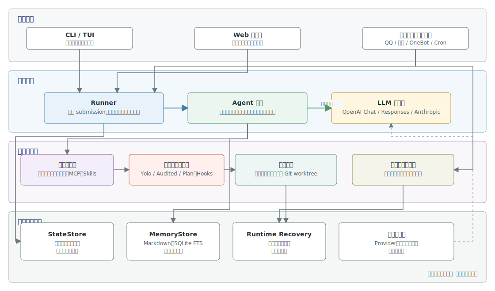

# Sai

**终端里的二次元 AI 桌面助手**
多协议 LLM 接入 · 30+ 内置工具 · 长期记忆 · 多平台网关 · Web 工作台 · 跨平台

[English](README.md) | 简体中文

[](LICENSE)
[](https://www.rust-lang.org/)
[](https://github.com/SHORiN-KiWATA/Sai)
[](https://github.com/SHORiN-KiWATA/Sai/actions/workflows/linux.yml)
[](https://github.com/SHORiN-KiWATA/Sai/actions/workflows/windows.yml)
[](https://github.com/SHORiN-KiWATA/Sai/actions/workflows/macos.yml)

[为什么是 Sai](#为什么是-sai) · [核心能力](#核心能力) · [安装](#安装) · [快速开始](#快速开始) · [CLI 命令](#cli-命令参考) · [架构总览](#架构总览) · [存储布局](#存储与目录布局) · [FAQ](#faq) · [贡献](#贡献)

---

## 为什么是 Sai?

Sai 是一个用 Rust 编写的终端 AI 桌面助手。它把大语言模型的推理能力与本地系统工具、长期记忆、聊天平台网关、Web 工作台深度整合,既能当 CLI 单轮问答工具,也能当交互式 REPL,还能作为常驻服务接入 QQ、微信、企业微信,或通过浏览器远程操控。

- **能动手的助手** - 不止于对话:读写文件、执行命令、调度子代理、跑深度研究与系统诊断
- **三协议自适应** - OpenAI Chat / OpenAI Responses / Anthropic Messages 三种协议自动识别,任意兼容供应商即插即用
- **有人格有记忆** - 跨会话长期记忆(facts / episodes),半衰期遗忘与联想召回,按人格隔离
- **多入口接入** - 终端 REPL、单轮 ask、Web 工作台、QQ / 微信 / 企业微信网关,同一套 Agent 内核

---

## 核心能力

### 多协议 LLM 接入

- **三协议自适应** - OpenAI Chat、OpenAI Responses、Anthropic Messages 三种协议,`auto` 模式按供应商自动选择,也可显式指定
- **任意兼容供应商** - 内置 opencode Zen、OpenAI、Anthropic 三套模板,支持自定义 `base_url` 接入任意第三方兼容服务
- **思维链控制** - `thinking_level` 七档(auto / none / low / medium / high / xhigh / max),`thinking_format` 兼容 string / object / deepseek-thinking / openai-chat-reasoning-effort / reasoning / anthropic-thinking 等多种推理协议
- **流式渲染** - Markdown 实时流式输出,内建 KaTeX 公式、Mermaid 图表、Syntect 代码高亮、o200k tokenizer 计数
- **上下文压缩** - 超长对话自动用专用压缩模型归纳历史,保留关键信息不丢上下文

### Agent 与渐进式工具系统

- **三种权限模式** - `Yolo` 自由调用工具、`Audited` 审计模式(沙盒 + 审计日志 + 逐次确认)、`Plan` 只读模式(仅允许只读工具)
- **渐进式工具加载** - 启动仅暴露 `load` 与基础工具,模型按需调用 `load` 加载工具组或 skill,可见集持久化到 `loaded-tools.json` 跨轮恢复
- **30+ 内置工具** - 按用途分组:`base` 基础文件命令、`web` 网络查询、`media` 图片与表情包、`research` 深度研究、`memory` 记忆操作、`package` Arch Linux 包管理、`game` 游戏兼容性、`diagnostics` 系统诊断、`knowledge` 知识库、`utilities` 计算与编码、`personal` 闹钟、`mcp` 外部工具
- **子代理** - `subagent` 工具启动独立 LLM 循环,带 `max_steps` 预算与超时;可写任务在 git 仓库内自动创建 `.sai-subagents` worktree 隔离,完成后自动 apply 回父工作区并清理
- **Skills 技能包** - `SKILL.md` 格式的可复用技能,支持启用 / 禁用 / 列出 / 统计 / 清理
- **MCP 协议桥接** - 原生支持 stdio / http 两种 MCP Server,工具名以 `mcp_` 前缀注入注册表,独立 `mcp.jsonc` 配置文件
- **会话级 Todo** - 任务计划清单,跨工具轮次跟踪进度
- **Cron 定时任务** - bash / http / prompt 三种类型,持久化到 `jobs.db`,后台调度器到期触发

### 长期记忆与上下文管理

- **双库结构** - `memory.db` 存 facts / episodes / pending_events / skill_records,`evicted_context.db` 存被上下文裁剪掉的旧轮次
- **FTS5 全文索引** - unicode61 + trigram 分词,中英文混合检索
- **Markdown 源文件** - 记忆同时以 `memory/files/{facts,episodes}/*.md` 形式落盘,可读可改
- **半衰期遗忘** - 基于 strength 的衰减算法实现自然遗忘,召回时 reinforce 强化高频记忆
- **联想召回** - 每轮对话前用关键词从 facts / episodes 召回相关记忆,注入系统消息
- **按人格隔离** - 记忆、表情包、skills 按 `persona` 目录隔离,不同人格互不干扰

### 多聊天平台网关

- **QQ Bot** - WebSocket 与 Webhook 两种传输方式,官方 QQ 频道 / 群 / 私聊
- **QQ Official** - 腾讯官方 QQ OpenAPI 客户端
- **微信 iLink** - 长轮询接入,支持扫码登录、图片 / 文件 / 视频消息
- **OneBot HTTP Server** - 标准 OneBot v11 协议服务端,对接任意 OneBot 实现
- **企业微信 Webhook** - 群机器人推送
- **并发监管** - `supervisor` 用 JoinSet 并发启动配置中启用的渠道,`manager` 管理后台任务生命周期
- **渠道工具** - 网关侧暴露 `send_channel_image` / `send_channel_file` / `send_channel_video` 等渠道消息工具,Agent 可主动向聊天平台回推媒体

### 权限审计与沙盒

- **三级权限** - Yolo / Audited / Plan 三种模式,TUI 与 CLI 可分别配置默认模式
- **工作区沙盒** - Audited 模式下,Linux 用 `bubblewrap` 限制文件写入在工作区内,Windows 与 macOS 保留审计检查但不提供命令隔离
- **敏感路径保护** - 读取敏感路径(SSH 密钥、凭证目录等)前强制请求权限
- **审计日志** - 每次 Requested / Approved / Denied 写入 `permission-audit.jsonl`,可追溯
- **权限 Broker** - 统一的请求 / 决策通道,TUI / CLI / Web 三端共用,支持附带拒绝理由

### Web 编程工作台

启动 `sai web` 后浏览器打开,得到一个完整的远程编程工作台:

- **多会话切换** - 会话列表、新建、重命名、删除、恢复
- **实时对话** - 与 REPL 等价的流式渲染,支持图片粘贴
- **Monaco 编辑器** - 内置代码编辑,与本地文件联动
- **xterm 终端** - 浏览器内完整终端,走平台 shell 抽象
- **子代理面板** - 查看子代理运行状态与时间线
- **后台任务管理** - 管理常驻进程、Cron 任务
- **系统监控** - CPU / RSS 实时图表
- **设置中心** - 供应商、模型、权限、网关、MCP、Hooks、记忆、人格、Skills 全图形化配置
- **国际化** - 中英文界面切换

#### 源代码管理

Web 工作台内置与 VS Code 风格一致的源代码管理工作区，底层调用系统 `git`，直接操作真实仓库。命令结束后会强制刷新；外部文件变化或 `.git` 元数据变化也会触发自动刷新。

**模块结构**

```text
Web 视图（Changes / Graph / Repositories / Diff / Merge Editor）
  -> ScmStateStore 与类型化命令注册表
  -> /api/workspace/git/*
  -> GitService 模块（状态 / 差异 / 历史 / 资源 / worktree）
  -> RepositoryWatcher（文件事件，300 毫秒防抖）
  -> 系统 git CLI
```

- `src/web/workspace/git_*.rs` 分别负责进程执行、状态、差异、分支、历史、冲突、仓库、资源、监听和 worktree。
- `src/web/api/workspace_git*.rs` 校验活动工作区中的仓库根目录，并提供 Git HTTP 接口和事件流接口。
- `web/src/features/source-control/` 包含 Changes、Graph、Repositories、Diff、Merge Editor、命令注册表、状态钩子、设置、确认框和 Git 输出视图。
- 仓库发现限制扫描深度，状态刷新限制并发数，Git 命令具备超时与锁冲突重试，Graph 只挂载可见行。

**界面操作与 Git 命令对照**

| 界面操作 | 系统 Git 命令 |
| --- | --- |
| 刷新状态 | `git status --porcelain=v2 --branch --show-stash -z` |
| 暂存 / 全部暂存 | `git add -- <paths>` / `git add -A --` |
| 取消暂存 / 全部取消暂存 | `git restore --staged -- <paths>` / `git restore --staged -- .` |
| 丢弃 / 全部丢弃 | `git restore --staged --worktree -- <paths>`；未跟踪文件使用 `git clean -fd -- <paths>` |
| 暂存 / 取消暂存 / 丢弃区块 | 使用经过校验的 unified patch 调用 `git apply --cached` 或 `git apply --reverse` |
| 提交变体 | `git commit -m`，可附加 `--amend`、`--signoff` 或 `--allow-empty` |
| 获取 / 拉取 / 拉取并变基 | `git fetch --prune`、`git pull`、`git pull --rebase` |
| 推送 / 强制推送 / 同步 | `git push`、`git push --force-with-lease`，或依次执行 pull 与 push |
| 分支操作 | `git switch`、`git switch -c`、`git branch -m/-d/-D`、`git merge`、`git rebase` |
| 历史操作 | `git switch --detach`、`git cherry-pick`、`git rebase`、`git reset`、`git revert --no-edit` |
| stash / 标签 / 远端 | `git stash`、`git tag`、`git remote add/remove/set-url` |
| 完成冲突操作 | `git add`，随后执行 merge/rebase/cherry-pick/revert 的 `--continue`、`--skip` 或 `--abort` |
| worktree | `git worktree list --porcelain -z`、`git worktree add`、`git worktree remove` |

**与 VS Code 功能差异**

| 范围 | 状态 | 当前行为 |
| --- | --- | --- |
| 变更与提交流程 | 已实现 | 多仓库分区、树形/列表视图、多选、暂存/取消暂存/丢弃、Smart Commit、修订、签署、提交后推送或同步 |
| 差异与部分暂存 | 已实现 | 正确选择 HEAD/Index/Working Tree；文本改动支持选中行与完整区块的暂存、取消暂存和还原，文件生命周期变化仍按完整区块处理 |
| 分支与远端 | 已实现 | 创建、切换、重命名、删除、合并、变基、获取、拉取、推送、同步、发布上游、租约强制推送 |
| 提交图 | 部分实现 | 分页和虚拟化历史、引用标签、待拉取/待推送标记、历史操作；提交轨道采用简化渲染 |
| stash、标签与远端 | 已实现 | 列表、创建、应用、弹出、删除、添加与移除，并支持 stash 补丁预览 |
| 冲突 | 部分实现 | 文本合并编辑器支持 base/ours/theirs 和流程控制；二进制与符号链接冲突需使用外部工具 |
| 多仓库与 worktree | 已实现 | 有限深度发现、仓库独立状态、关闭/恢复显示、创建/打开/移除 worktree |
| Git 输出与失败 | 已实现 | 非零退出状态显示 stderr，Git 输出面板保留命令详情，破坏性命令使用项目统一对话框确认 |
| GitHub 发布与 PR 审核 | 未实现 | 已支持通用远端发布；GitHub 登录、仓库列表和 PR 审核不在当前范围内 |

**源代码管理快捷键**

| 快捷键 | 操作 |
| --- | --- |
| `Ctrl+Enter` / `Cmd+Enter` | 在提交说明输入区执行主提交动作 |
| `Ctrl+单击` / `Cmd+单击` | 切换当前文件的多选状态 |
| `Shift+单击` | 从当前锚点扩展文件选择范围 |
| `Escape` | 关闭文件或提交右键菜单 |

### 跨平台 Shell 集成

- **Shell 拦截** - 命令未找到时自动转发给 Agent,用自然语言解释或建议修复
- **Hook 安装** - `sai fish-init` / `bash-init` / `zsh-init` / `powershell-init` 一键安装对应 shell 的命令未找到 hook
- **平台抽象** - Windows 优先 `SHELL`,其次 `pwsh.exe` / `powershell.exe` / `cmd.exe`;POSIX 走 `-lc` 参数
- **系统目录** - Linux 遵循 XDG 规范，Windows 与 macOS 使用各自的标准应用目录

### 国际化

- **中英双语** - `en-US` 与 `zh-CN` 两种界面语言,通过 `SAI_LANG` / `LC_ALL` / `LANG` 自动检测,`--lang` 显式覆盖
- **全链路本地化** - CLI 提示、TUI 界面、Web 工作台、错误消息均支持双语

---

## 安装

### 系统要求

| 平台 | 要求 |
| --- | --- |
| Linux | x86_64,需 `ripgrep`(文件搜索)、`alsa-lib`(音频闹钟);审计沙盒需 `bubblewrap` |
| Windows | x86_64,需 WebView2 或现代浏览器访问 Web 工作台;需 `ripgrep` |
| macOS | Apple Silicon 或 Intel，需要现代浏览器访问 Web 工作台，建议安装 `ripgrep` |

### 从源码构建

需要 Rust stable、Node.js 22、npm。

```bash
# 1. 克隆仓库
git clone https://github.com/SHORiN-KiWATA/Sai.git
cd Sai

# 2. 构建前端资源(Web 工作台)
cd web
npm ci
npm run build
cd ..

# 3. 构建 Sai 二进制
cargo build --release --locked

# 4. 验证
./target/release/sai --version
```

Linux 额外需要系统依赖:

```bash
sudo apt-get install --yes \
  libasound2-dev \
  libwayland-dev \
  libxkbcommon-dev \
  pkg-config \
  ripgrep
```

### Arch Linux

仓库提供 `scripts/package-arch.sh` 打包脚本,构建 `.pkg.tar.zst` 后用 `pacman -U` 安装:

```bash
cargo build --release --locked
bash scripts/package-arch.sh
sudo pacman -U ~/.cache/sai/packages/sai-<version>-1-x86_64.pkg.tar.zst
```

### 预编译二进制

每次推送到 `main` 分支会触发 GitHub Actions 构建 Linux、Windows 与 macOS 二进制，前往 [Actions](https://github.com/SHORiN-KiWATA/Sai/actions) 页面下载对应平台的 artifact。

---

## 快速开始

### 1. 初始化

首次运行会自动进入初始化向导,生成配置目录与默认文件:

```bash
sai init
```

或直接启动 REPL,缺省配置时自动初始化:

```bash
sai
```

### 2. 配置供应商

编辑配置文件(Linux `~/.config/sai/config.jsonc`,macOS `~/Library/Application Support/sai/config.jsonc`,Windows `%APPDATA%\sai\config.jsonc`):

```jsonc
{
  "active_provider": "opencode",
  "providers": [
    {
      "id": "opencode",
      "display_name": "opencode Zen",
      "base_url": "https://opencode.ai/zen/v1",
      "protocol": "auto",
      "default_model": "big-pickle"
    }
  ]
}
```

API Key 写入 `secrets.jsonc`(同目录),支持 `$env:VAR_NAME` 引用环境变量:

```jsonc
{
  "api_keys": {
    "opencode": "$env:OPENCODE_API_KEY",
    "anthropic": "$env:ANTHROPIC_API_KEY"
  }
}
```

也可用内置 TUI 配置器或 `sai web` 的设置中心图形化编辑。

### 3. 交互式 REPL

```bash
sai
```

REPL 内支持多行输入、图片粘贴(`-c` 从剪贴板读图)、`!` 前缀执行 shell、`/` 前缀执行控制命令、模糊搜索历史、流式渲染推理与正文。

### 4. 单轮对话

```bash
sai ask "用 rust 写一个快速排序"
sai ask -c "这张图里是什么"        # 附带剪贴板图片
sai ask -w "最新 rust 稳定版特性"  # 触发联网搜索
```

### 5. 启动 Web 工作台

```bash
sai web --port 4096
```

默认自动打开浏览器,访问 `http://localhost:4096`。

### 6. Shell 拦截

安装 hook 后,终端里输入不存在的命令会自动转发给 Sai:

```bash
sai fish-init      # 或 bash-init / zsh-init / powershell-init
exec $SHELL        # 重新加载 shell

# 之后输入不存在的命令
$ nonexist-cmd --flag
# Sai 会接管并给出解释或建议
```

### 7. 接入聊天平台

编辑 `config.jsonc` 的 `gateways` 段,或用 `sai gateway` 子命令手动拉起单个渠道。配置好后用 `sai gateway start` 一次性启动所有已启用渠道。

---

## CLI 命令参考

| 命令 | 说明 |
| --- | --- |
| `sai` | 进入交互式 REPL |
| `sai ask <message>` | 单轮对话,支持 `-c` 附图、`-w` 联网 |
| `sai web [--port N] [--no-open]` | 启动 Web 编程工作台 |
| `sai init` | 初始化配置目录 |
| `sai paths` | 打印所有目录位置 |
| `sai config validate` | 校验配置文件 |
| `sai config paths` | 打印配置路径 |
| `sai providers [index]` | 查看或切换当前供应商 |
| `sai set thinking [level]` | 设置思维链等级 |
| `sai fish-init` / `bash-init` / `zsh-init` / `powershell-init` | 安装对应 shell 的命令未找到 hook |
| `sai remove-shell-hook` | 移除已安装的 shell hook |
| `sai history [--limit N] [--raw]` | 查看对话历史 |
| `sai sessions list` / `new` / `switch` / `resume` / `current` / `delete` / `rename` | 会话管理 |
| `sai resume [id]` | 恢复指定会话,省略 ID 进入交互选择 |
| `sai kb add/list/search/find/read/remove/reindex/stats/embed` | 本地知识库管理 |
| `sai memory stats/reset/search/remember` | 记忆管理 |
| `sai skills list/show/enable/disable/remove/stats/prune` | Skills 技能包管理 |
| `sai ps` | 后台命令管理 |
| `sai gateway start` | 启动配置中所有已启用渠道 |
| `sai gateway qq-bot` / `qq-bot-webhook` / `qq-official` | QQ 渠道 |
| `sai gateway onebot-server` / `weixin-server` / `wecom-webhook` | 其他渠道 |
| `sai weixin-login` | 微信扫码登录 |
| `sai clear [--memory] [scope]` | 清空对话或记忆 |
| `sai compact` | 手动触发上下文压缩 |

全局参数:`--lang en-US|zh-CN`(语言)、`--plan` / `--audited` / `--yolo`(权限模式)、`--thinking LEVEL`(思维链)、`-c`(剪贴板)、`-w`(联网搜索)。

---

## 架构总览

Sai 采用共享 Runner 与 Agent 内核的分层架构。各入口先把请求归一化为 submission，再由 Runner 和 Agent 协调 LLM、工具、记忆与会话状态。



### 技术栈

| 组件 | 技术 |
| --- | --- |
| 核心 | Rust 2021 edition · Tokio 异步运行时 |
| LLM 客户端 | reqwest + rustls · SSE 流式 · 三协议自适应 |
| 存储 | rusqlite (bundled) · SQLite WAL · FTS5 全文索引 |
| 终端 | crossterm · termimad · ratex (LaTeX) · syntect 高亮 · mermaid-rs-renderer |
| Web 服务 | axum + WebSocket + 嵌入式静态资源 |
| Web 前端 | React 19 · Vite 8 · TypeScript · Monaco · xterm · KaTeX · Mermaid · TanStack Query |
| 构建 | build.rs(prompt 混淆 + o200k tokenizer 编译)· rust-embed |
| CI | GitHub Actions(Linux + Windows + macOS) |

### 项目结构

```
Sai/
├── src/
│   ├── agent/            # Agent 内核:循环、模式、压缩、子代理、上下文投影
│   ├── cli/              # CLI 子命令分发与 REPL 实现
│   ├── llm/              # LLM 客户端:三协议、流式、thinking、工具流解析
│   ├── tools/            # 30+ 内置工具、注册表、渐进加载、子代理、Skills
│   ├── memory/           # 长期记忆:facts/episodes/FTS5/衰减/联想
│   ├── state/            # 会话状态:turns WAL、pending、压缩、快照、恢复
│   ├── gateways/         # 多平台网关:QQ/微信/OneBot/企业微信、supervisor
│   ├── config/           # 配置:AppConfig、供应商、权限、网关、MCP、模型
│   ├── permission/       # 权限:Broker、策略、沙盒、审计日志
│   ├── mcp/              # MCP 协议桥接:stdio/http 客户端与注册
│   ├── shell/            # Shell hook:fish/bash/zsh/powershell
│   ├── platform/         # 跨平台 shell 抽象
│   ├── web/              # Web 工作台服务端
│   ├── render/           # 终端流式渲染
│   ├── prompts/          # 系统提示模板(build.rs 混淆嵌入)
│   ├── i18n/             # 中英文国际化
│   ├── cron/             # 定时任务调度
│   └── ...               # alarm/memes/knowledge_base/hooks 等
├── web/                  # Web 工作台前端(React + Vite)
├── assets/               # o200k tokenizer 词表
├── pics/                 # 截图与架构总览图
├── scripts/              # 打包脚本(package-arch.sh)
├── .github/workflows/    # CI(linux.yml + windows.yml + macos.yml)
├── build.rs              # 构建脚本
└── Cargo.toml            # Rust 包定义
```

---

## 存储与目录布局

Sai 遵循 Linux 的 XDG、macOS 的 Application Support/Caches 与 Windows 的 Known Folders 规范,所有路径可用 `sai paths` 查看。

### 配置目录

Linux `~/.config/sai` / macOS `~/Library/Application Support/sai` / Windows `%APPDATA%\sai`

| 文件 / 目录 | 用途 |
| --- | --- |
| `config.jsonc` | 主配置:供应商、权限、网关、插件、人格等 |
| `secrets.jsonc` | API Key 密钥文件,支持 `$env:VAR` 引用 |
| `mcp.jsonc` | 独立 MCP 服务器配置 |
| `skills/` | 已安装的 Skills 技能包目录 |
| `persona/` | 人格目录:`system-prompt.md`、`identities/` |
| `shell/` | Shell hook 脚本(fish / bash / zsh / powershell) |

### 状态目录

Linux `~/.local/state/sai` / macOS `~/Library/Application Support/sai` / Windows `%LOCALAPPDATA%\sai`

| 文件 / 目录 | 用途 |
| --- | --- |
| `conversation.db` | SQLite WAL 对话轮次存储 |
| `usage.json` | Token 用量统计 |
| `loaded-tools.json` | 渐进式工具可见集(跨轮恢复) |
| `prompt.sha256` | 系统提示指纹,变更则重置会话 |
| `profile.md` | 用户画像 |
| `sai.log` | 运行日志 |
| `alarms/` | 闹钟状态与日志 |
| `permission-audit.jsonl` | 权限审计日志 |

### 数据目录

Linux `~/.local/share/sai` / macOS `~/Library/Application Support/sai` / Windows `%APPDATA%\sai`

| 文件 / 目录 | 用途 |
| --- | --- |
| `kb/` | 本地知识库:文件 + 关键词索引 + 语义嵌入 |
| `persona/<name>/memes/` | 表情包图片与索引(按人格隔离) |
| `persona/<name>/memory/memory.db` | 记忆元数据 + FTS5 索引 |
| `persona/<name>/memory/files/` | Markdown 记忆源文件(facts / episodes) |
| `persona/<name>/memory/evicted_context.db` | 被裁剪的旧上下文 |
| `persona/<name>/skills/` | 自动学习的 skill |

### 其他目录

- 缓存:Linux `~/.cache/sai` / macOS `~/Library/Caches/sai` / Windows `%LOCALAPPDATA%\sai`
- 图片产物:Linux `~/Pictures/sai` / macOS `~/Pictures/sai` / Windows `Pictures\sai`

---

## FAQ

**API Key 会离开本机吗?**

不会。Key 仅保存在本地 `secrets.jsonc`,请求由本地 LLM 客户端直连供应商。网关模式同样由本地 Agent 发起请求,聊天平台只做消息中继。

**必须配置网关吗?**

不需要。终端 REPL、单轮 ask、Web 工作台全部本地可用;只有想让 QQ / 微信等聊天平台接入 Agent 时才配置网关。

**支持哪些模型?**

任何兼容 OpenAI Chat、OpenAI Responses、Anthropic Messages 三种协议的模型均可接入。默认内置 opencode Zen、OpenAI、Anthropic 三套模板,可自定义 `base_url` 接入第三方中转。

**长对话上下文会丢吗?**

不会。超出字符预算的旧轮次会写入 `evicted_context.db`,可被记忆工具召回;同时支持用专用压缩模型归纳历史,保留要点。

**Windows 或 macOS 上能用沙盒吗?**

不能。审计沙盒依赖 Linux `bubblewrap`。Windows 与 macOS 上的 Audited 模式仍保留审计日志、工作区路径校验与逐次确认，但不提供命令隔离。

**子代理会污染主工作区吗?**

不会。可写子代理任务在 git 仓库内自动创建 `.sai-subagents` worktree 隔离,完成后才 apply 回父工作区并清理。

---

## 贡献

欢迎提交 Issue 与 Pull Request。提交前请确保:

1. Rust 测试通过:`cargo test --locked`
2. Web 前端构建与测试通过:`cd web && npm ci && npm run build && npm test`
3. 配置校验通过:`sai config validate`
4. 提交信息遵循 Conventional Commits(`feat:` / `fix:` / `docs:` 等)

## License

[MIT](LICENSE) © SHORiN-KiWATA
